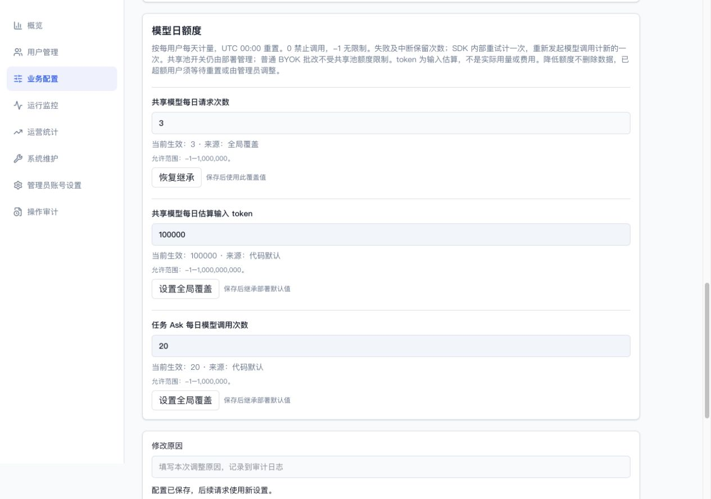
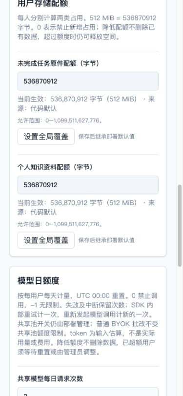
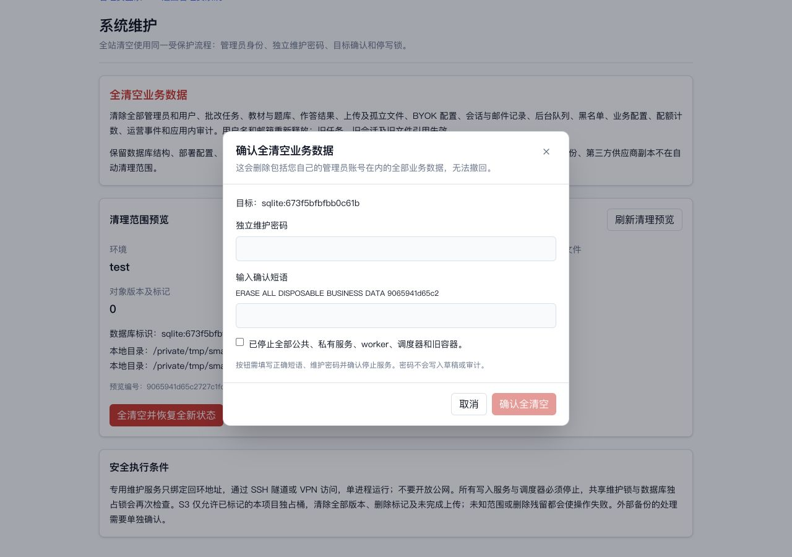
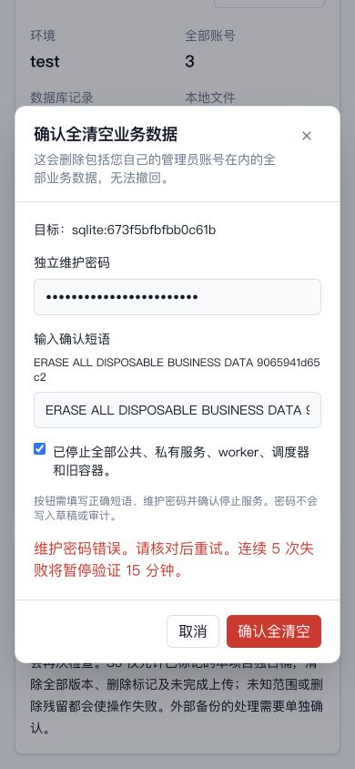
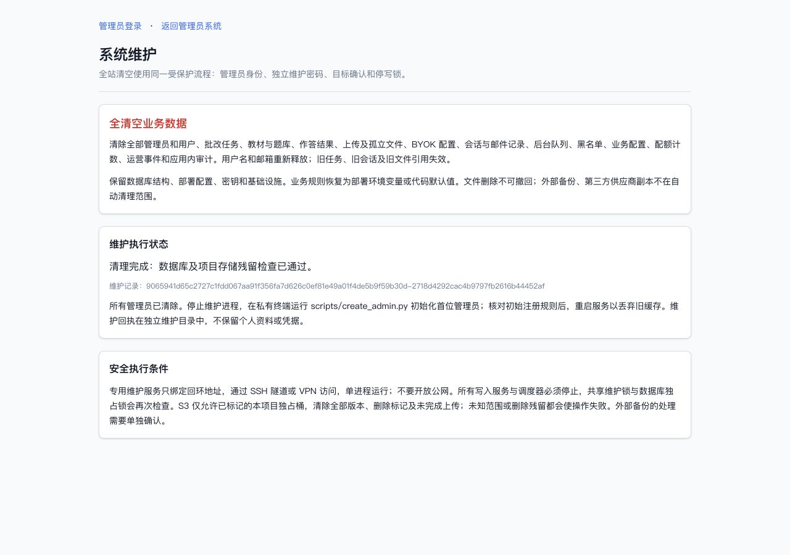
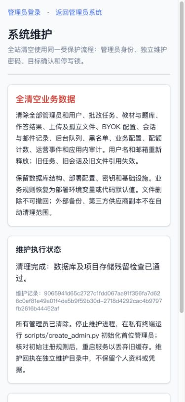

# 管理员查缺补漏验收 · 2026-10-03

资源：既有独立 SmarTAI-admin-completion、临时 SQLite/local roots、独立 localhost PostgreSQL。
邮件、模型和对象存储用测试替身。没有真实 AWS、SMTP、S3 或供应商验收，没有线上清空。

保留既有账号/密码/角色/权限/邮箱/存储/监控功能；本轮补受保护维护按钮和持久化模型额度。

- SQLite 相关迁移/管理/配置/任务 Ask：122 passed / 1 skipped；新增维护/额度回归：48 passed / 1 skipped。
- 最终核心管理/配置/迁移组合：98 passed；最终维护/私有入口/销户/额度组合：28 passed。
- PostgreSQL 升级/业务/新模型并发：31 passed。SQLite+PostgreSQL 全范围清理（fake S3）：69 passed / 2 skipped。
- 前端全量 101 文件 / 522 passed，lint/TypeScript、公共 dist、独立 dist-admin 构建成功。
- 实际公共生产构建 Playwright 2 passed（公共路由隔离、三角色教学流程）。
- 上述组合有重叠，不能相加成总覆盖数；全量后端以此 PR 精确 head 的 CI 为准。

图形化：实际管理 SPA，1280×900 和 390×844；无横向溢出。模型非法值/未保存离开/保存
反馈，维护禁用原因/错误密码/取消清除/真实合成库清空/刷新后完成状态均操作验证。
浏览器全清空后，所有业务表零行、local roots 只留标记，重新 bootstrap、原教师和
黑名单身份重新注册、权限不继承、覆盖配置清除见 browser-reset-validation.json。

受保护实际操作及重新初始化见 ../../ADMIN_RESET.md；额度计量/继承见 ../../ADMIN_BUSINESS_CONFIG.md。
仍需上线前真实资源登记、IAM/对象 API、外部任务生命周期、私有网关/Cookie 配置验收；
任何真实不可恢复清空必须由项目负责人单独确认。
