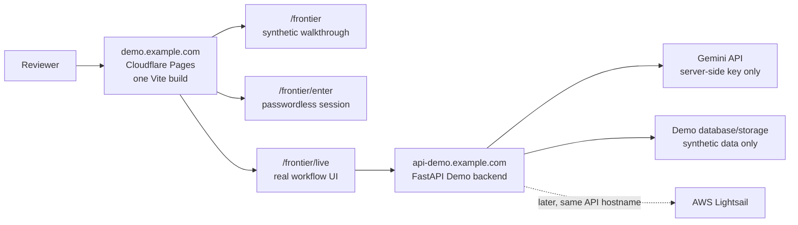

# SmarTAI 产品 Demo：本地运行与公网部署手册

> 核对日期：2026-08-11（Asia/Singapore）
>
> 当前工作分支：`codex/aws-frontier-demo-20260812`
>
> 本文不硬编码最终部署 SHA。部署前必须用下文命令读取当前完整 SHA，并确认前后端来自同一个干净提交。

本文适用于可长期复用的 SmarTAI **合成数据产品演示**。宣传页可以展示明确标注的预计算 walkthrough；`/frontier/live` 的任务创建、题目识别、视觉 OCR、作答识别和批改必须调用真实后端与真实模型。首次部署可服务当前截止期，但公开页面不绑定任何活动品牌。真实学生数据或生产发布仍必须先通过：

`docs/active_beta_launch/20260803_leader_replan/PRE_PRODUCTION_SECURITY_RELEASE_GATE_CN.md`

## 1. 结论先行

报名突击期采用一套前端构建、一个独立 Demo 后端：

- **前端：一个 Cloudflare Pages 项目。** 同一个 `frontend/app` 构建同时提供 `/frontier`、`/frontier/enter`、`/frontier/live` 和现有真实 App 路由。不要把宣传页和 Live Demo 拆成两个分支、两个 Pages 项目或两个前端实例。
- **后端：一个独立 FastAPI Demo 服务。** 截止日前优先沿用 Render，Gemini Key 只写入 Render Secret Environment，不进入 Vite 环境、仓库、URL、fixture 或网页。
- **源码：前后端锁定同一个最终 Demo 分支和 SHA。** 前后端分别部署是运行形态，不是两套源码。部署成功后关闭不必要的自动部署，避免 `main` 或后续开发自动改变 Demo。
- **入口：一个稳定的产品链接，另有一个稳定 API 域名。** 推荐 `https://demo.<你的域名>/frontier` 和 `https://api-demo.<你的域名>`。若暂时没有自定义域名，可先用稳定的 `<project>.pages.dev` 与 `<service>.onrender.com`，但后端迁移会要求重建前端。
- **8 月 12 日截止方案：Render Free 可以作为报名临时方案，但不是持续在线保证。** 它会休眠、冷启动、丢失本地盘，且 512 MB / 0.1 CPU 对当前 Python、PDF/OCR 依赖是否足够仍须以公网真实 E2E 为准。若冷启动后或完整批改出现 OOM/超时，直接把**同一个 Render 服务**升级到付费实例，不另建新 URL。
- **AWS Lightsail：更稳的备选和后续迁移目标。** 不在截止前为了“看起来更 AWS”而冒险换掉已经验证的报名链接。先绑定稳定 `api-demo` 域名，Lightsail 通过 E2E 后只切后端 DNS。
- **不建议一个 Render 运行时同时托管前后端。** 当前前端是 Vite 静态产物，后端是 FastAPI；合并需要新增静态文件挂载、构建和路由配置，会放大冷启动与回滚影响。Cloudflare Pages + Render API 已经是“一个公网产品入口 + 一个 API 域名”，不需要把两个运行时塞进一个 512 MB 实例。

## 2. 推荐拓扑



关键边界：

- `VITE_SMARTAI_BACKEND_URL` 只包含后端 URL；它会在 `npm run build` 时写入静态 bundle，不能放任何秘密。
- `FRONTEND_URLS` 是 FastAPI CORS 的**精确 origin 列表**，只能写 `scheme://host[:port]`，不要带路径、尾斜杠或空格。
- `/auth/frontier-demo-session` 只有在 Demo、shared pool 和后端 Gemini Key 都启用时才签发短时随机 owner；无密码、无 refresh cookie。
- `SMARTAI_FRONTIER_DEMO_ENABLED=false` 是 Demo 会话 kill switch；`SMARTAI_SHARED_POOL_ENABLED=false` 是共享模型 kill switch。
- 当前签发计数和 shared-pool 额度均有进程内状态成分；进程重启或多 worker 不共享。这是报名演示简化边界，不得宣传为生产级平台总预算控制。

## 3. 当前代码与配置核对结果

| 项目 | 当前事实 | 部署含义 |
|---|---|---|
| 前端路由 | `frontend/app/src/main.tsx` 的一个 `createBrowserRouter` 同时注册 `/frontier`、`/frontier/enter`、`/frontier/live` 和真实任务路由 | 只构建、部署一次前端 |
| API 地址 | `frontend/app/src/api/client.ts` 读取 `VITE_SMARTAI_BACKEND_URL`，默认 `http://localhost:8000` | 公网构建前必须写稳定 API URL |
| 后端健康 | `/health` 检查进程；`/ready` 同时检查数据库与 storage | Render health check 应继续使用 `/ready` |
| CORS | `backend/main.py` 从 `FRONTEND_URLS` 逗号分隔读取，并允许 credentials | 必须填 Cloudflare 的精确生产 origin |
| Render Blueprint | 文件在 `backend/render.yaml`，不是仓库根默认 `render.yaml` | 创建 Blueprint 时显式选择 `backend/render.yaml`；也可手工创建一个 Web Service |
| Blueprint 数据模式 | 当前写死 `SMARTAI_DATABASE_HEAVY=ON`、`SMARTAI_STORAGE_BACKEND=object`，相关 URL/S3 值均为 `sync:false` | 未填 Postgres 与 S3-compatible secrets 时 `/ready` 不会通过 |
| Blueprint CORS | 当前仍是 `http://localhost:3000,http://localhost:8001` 占位 | 公网部署前必须在 Dashboard 改掉 |
| Blueprint Demo | 当前显式启用 Demo、shared pool、12 次/日签发、5 秒冷却、100 请求/owner/日、估算 250000 tokens/owner/日 | 是报名演示配置；不是持久平台总预算 |
| Fixture | `frontend/app/public/frontier-demo/SHA256SUMS` 当前校验通过；最大单文件小于 1 MiB | 远低于 Pages 25 MiB 单文件上限；最终提交仍要重跑校验 |
| 宣传片 | `frontend/app/public/frontier-media/` 含中英文 v4.1 正式成片，各约 6.2 MiB、66 秒、H.264/AAC，并有独立 `SHA256SUMS` | 按当前页面选择只加载一支；两支均低于 Pages 25 MiB 单文件上限，不经过 Render |
| Docker | 当前仓库没有 Demo Dockerfile/Compose | 截止前不要临时改成容器化新架构；Lightsail B 路径先用 venv + systemd |

## 4. 准备清单

在启动或部署前逐项确认：

- [ ] 最终 Demo 改动已经提交，`git status --short` 无输出。
- [ ] 记录最终分支、完整 SHA；Cloudflare 与 Render 都显示同一个 SHA。
- [ ] 本地或服务端 secret store 中有可用 Gemini Key；没有任何 `VITE_*` 变量包含 Key。
- [ ] 确认 `SMARTAI_GEMINI_MODEL` 是该 Key 当前可调用且支持视觉输入的模型。仓库当前 Blueprint 值为 `gemini-3.5-flash`，本文没有完成真实 provider 验证。
- [ ] `SMARTAI_REQUIRE_AUTH=true`、`SMARTAI_ALLOW_DEMO_TOKENS=false`、`SMARTAI_REGISTRATION_CLOSED=true`。
- [ ] `SMARTAI_FRONTIER_DEMO_ENABLED=true`、`SMARTAI_SHARED_POOL_ENABLED=true`，并设置保守并发、请求与 token 上限。
- [ ] 数据环境只含合成 fixture；禁止真实学生、教师或学校数据。
- [ ] 在 `frontend/app/public/frontier-media/` 运行 `shasum -a 256 -c SHA256SUMS`，两支宣传片均为 `OK`。
- [ ] `/health` 返回 200；`/ready` 返回 200 且 `database=true, storage=true`。
- [ ] 冷启动后完整跑通一次 `/frontier/enter → /frontier/live → graded`，记录 task ID、job ID、用时和模型调用量。
- [ ] 从无缓存浏览器重新打开 `/frontier`、`/frontier/enter`、`/frontier/live` 深链接。
- [ ] 公网 bundle 搜索不到 Gemini Key、JWT secret 或数据库/storage credentials。
- [ ] 报名只填写稳定前端 URL，不填写原始临时 task URL。

## 5. 本地运行：按顺序复制

以下命令按 macOS + zsh、Conda 环境 `smartai`、Node 22 编写。两个服务分别以前台进程运行，最容易看见真实错误。

### 5.1 进入工作树并确认冻结候选

```bash
cd /private/tmp/SmarTAI-aws-frontier-demo
git branch --show-current
git rev-parse HEAD
git status --short
```

期望分支是 `codex/aws-frontier-demo-20260812`。只有最终准备部署时才要求 `git status --short` 无输出；本地开发阶段可以有明确知道来源的改动。

### 5.2 第一次本地 smoke：先在当前 shell 导出变量

这套命令不会把 Gemini Key写进文件或 shell history；输入时终端不回显。

```bash
cd /private/tmp/SmarTAI-aws-frontier-demo

export SMARTAI_GRADING_ENGINE='v2'
export SMARTAI_DEFAULT_PROVIDER='gemini'
export SMARTAI_REQUIRE_AUTH='true'
export SMARTAI_ALLOW_DEMO_TOKENS='false'
export SMARTAI_REGISTRATION_CLOSED='true'
export SMARTAI_SEED_TEST_USERS='false'

export SMARTAI_DATABASE_HEAVY='OFF'
export SMARTAI_DATABASE_URL_LIGHT='sqlite:////private/tmp/smartai-frontier-local/smartai.db'
export SMARTAI_DATABASE_AUTO_CREATE='true'
export SMARTAI_STORAGE_BACKEND='local'
export SMARTAI_STORAGE_ROOT='/private/tmp/smartai-frontier-local/uploads'
mkdir -p /private/tmp/smartai-frontier-local/uploads

export SMARTAI_FRONTIER_DEMO_ENABLED='true'
export SMARTAI_FRONTIER_DEMO_SESSION_MINUTES='20'
export SMARTAI_FRONTIER_DEMO_DAILY_SESSION_LIMIT='0'
export SMARTAI_FRONTIER_DEMO_SESSION_COOLDOWN_SECONDS='0'
export SMARTAI_SHARED_POOL_ENABLED='true'
export SMARTAI_SHARED_POOL_DAILY_REQUEST_LIMIT='100'
export SMARTAI_SHARED_POOL_DAILY_ESTIMATED_TOKEN_LIMIT='250000'
export SMARTAI_MULTI_SAMPLE_N='1'
export SMARTAI_MAX_CONCURRENT_JOBS='2'
export SMARTAI_MAX_CONCURRENT_LLM_PER_PROVIDER='1'
export SMARTAI_OCR_CONCURRENCY='1'
export SMARTAI_SANDBOX_CONCURRENCY='2'

export SMARTAI_GEMINI_MODEL='gemini-3.5-flash'
read -r -s 'SMARTAI_GEMINI_API_KEY?Gemini API Key（输入隐藏）: '
export SMARTAI_GEMINI_API_KEY
printf '\n'

export JWT_SECRET="$(openssl rand -hex 32)"
export SMARTAI_REFRESH_COOKIE_SECURE='false'
export SMARTAI_REFRESH_COOKIE_SAMESITE='lax'
export FRONTEND_URLS='http://127.0.0.1:5173,http://localhost:5173'
export SMARTAI_HTTP_PROXY=''
export SMARTAI_HTTPS_PROXY=''
```

`SMARTAI_FRONTIER_DEMO_DAILY_SESSION_LIMIT=0` 表示本地签发不限次数，方便反复测试；它不是按 IP 计数。公网 Render 配置使用单进程全局 `100` 次/UTC 日和 `1` 秒冷却。当前计数存在单进程内存中，重启会清零，多 worker 也不会共享，因此它只是截止期 Demo 的轻量门禁。

如果本机访问 Gemini 必须经过代理，只在当前 shell 或私有 env 文件中填写真实代理 URL，再启动后端；不要沿用一个猜测端口：

```bash
export SMARTAI_HTTP_PROXY='<your-local-http-proxy-url>'
export SMARTAI_HTTPS_PROXY='<your-local-http-proxy-url>'
```

### 5.3 可选：改用私有 `.env.frontier.local`

根 `.gitignore` 已忽略 `.env.*`。后端只会自动读取名为 `.env` 的文件，因此自定义文件必须先 `source`。先创建权限为 600 的文件：

```bash
cd /private/tmp/SmarTAI-aws-frontier-demo
umask 077
touch .env.frontier.local
chmod 600 .env.frontier.local
nano .env.frontier.local
```

把 5.2 的非 `export` 形式变量写入文件；以下两个值只在本机编辑器里替换，绝不提交：

```dotenv
JWT_SECRET=<generate-a-long-random-value-locally>
SMARTAI_GEMINI_API_KEY=<paste-the-key-only-in-this-private-file>
```

每次启动后端前加载：

```bash
cd /private/tmp/SmarTAI-aws-frontier-demo
set -a
source .env.frontier.local
set +a
```

### 5.4 校验 migration 与 fixture

```bash
cd /private/tmp/SmarTAI-aws-frontier-demo
conda run -n smartai python -m alembic upgrade head
cd frontend/app/public/frontier-demo
shasum -a 256 -c SHA256SUMS
```

`SHA256SUMS` 必须全部为 `OK`。

### 5.5 启动后端（终端 A）

确认终端 A 已完成 5.2 的 `export` 或 5.3 的 `source`：

```bash
cd /private/tmp/SmarTAI-aws-frontier-demo
conda run --no-capture-output -n smartai python -m uvicorn backend.main:app --host 127.0.0.1 --port 8000
```

保持此终端打开。不要用 `--reload` 做最终真实流程证据；文件变化触发重启会中断后台 OCR/批改。

### 5.6 安装、构建并启动前端（终端 B）

```bash
cd /private/tmp/SmarTAI-aws-frontier-demo/frontend/app
export VITE_SMARTAI_BACKEND_URL='http://127.0.0.1:8000'
npm ci
npm run build
npm run dev -- --host 127.0.0.1 --port 5173
```

`VITE_SMARTAI_BACKEND_URL` 是构建期变量；修改后必须重启 dev server，公网则必须重新构建。

### 5.7 健康、路由与 Demo 会话自检（终端 C）

```bash
curl -fsS http://127.0.0.1:8000/health
curl -fsS http://127.0.0.1:8000/ready

curl -fsSI http://127.0.0.1:5173/frontier
curl -fsSI http://127.0.0.1:5173/frontier/enter
curl -fsSI http://127.0.0.1:5173/frontier/live

curl -fsS -o /dev/null -w 'frontier demo session HTTP %{http_code}\n' \
  -X POST http://127.0.0.1:8000/auth/frontier-demo-session
```

期望：`/health` 为 `healthy`，`/ready` 为 `ready`，三个前端 URL 为 200，Demo session 为 200。最后一个命令会消耗一次当日签发额度，但不会把短时 token 打印到终端。

### 5.8 完整真实流程自检

```bash
open http://127.0.0.1:5173/frontier
```

在浏览器中按以下顺序检查：

1. `/frontier` 的 CTA 进入 `/frontier/enter`。
2. 入口页从后端取得短时会话，再进入 `/frontier/live`。
3. 点击开始真实运行；页面应显示真实 task ID，并先调用完整的 `/tasks/{task_id}/question-preparation/jobs` 题目准备流程。
4. 检查本次真实生成的题干、标答、评分依据、编程参考代码与测试资料；教师确认后才继续。不得改用窄兼容 `/extract_problems` 文件入口，也不得注入 fixture 自带的固定标答或 rubric。
5. 状态再依次经过作答识别/vision OCR、批改，最终为 `graded`、`review_confirmed` 或 `finalized`；页面保留真实 job ID。
6. 手写 fixture 必须实际经过 vision OCR；不得把 walkthrough 的预计算分数当成本次结果。
7. 从题目审核或其他任务详情返回 `/frontier/live?taskId=...` 时，应自动恢复同一任务的当前视图；只有点击“开始新的真实运行”才替换当前任务。
8. 若真实流程失败，页面先显示安全真实错误；静态 walkthrough 只能由用户主动打开。
9. 记录最终 SHA、task ID、job IDs、模型名、开始/结束时间、总耗时和模型控制台用量。

### 5.9 停止与重启

最安全的停止方式是在终端 A、B 分别按 `Ctrl-C`。如果终端丢失，先检查端口所属进程，再优雅结束：

```bash
lsof -nP -iTCP:8000 -sTCP:LISTEN
lsof -nP -iTCP:5173 -sTCP:LISTEN

SMARTAI_BACKEND_PID="$(lsof -tiTCP:8000 -sTCP:LISTEN)"
SMARTAI_FRONTEND_PID="$(lsof -tiTCP:5173 -sTCP:LISTEN)"
test -z "$SMARTAI_BACKEND_PID" || kill -TERM "$SMARTAI_BACKEND_PID"
test -z "$SMARTAI_FRONTEND_PID" || kill -TERM "$SMARTAI_FRONTEND_PID"
```

重启时：

1. 终端 A 重新执行 5.2，或 `source .env.frontier.local`，再执行 5.5。
2. 终端 B 重新 `export VITE_SMARTAI_BACKEND_URL=...`，再执行 `npm run dev -- --host 127.0.0.1 --port 5173`。
3. 重跑 5.7 和 5.8。

SQLite 文件位于 `/private/tmp/smartai-frontier-local/`；普通停止/重启不会主动清理它。

## 6. 公网 A：Cloudflare Pages + 一个 Render Demo 后端（截止方案）

### 6.1 先冻结同一个分支/SHA

```bash
cd /private/tmp/SmarTAI-aws-frontier-demo
git status --short
git branch --show-current
git rev-parse HEAD
git log -1 --format='%H %cI %s'
```

部署门禁：

- `git status --short` 必须为空。
- 把完整 SHA 复制到部署记录。
- Cloudflare production branch 与 Render branch 都选 `codex/aws-frontier-demo-20260812`。
- 两边部署页面都必须显示同一个最终 SHA。
- 验证完成后关闭无关 preview build；冻结期不要再向该分支 push。Cloudflare 官方允许分别关闭 production/preview 自动部署，见[分支部署控制](https://developers.cloudflare.com/pages/configuration/branch-build-controls/)；Render rollback 后也应确认 autodeploy 状态，见[Render rollbacks](https://render.com/docs/rollbacks)。

### 6.2 先部署后端，取得稳定 API URL

当前可选两种 Render 数据方式：

#### A1. 已有 Postgres 与 S3-compatible storage：使用当前 Blueprint

1. Render 新建 Blueprint，代码仓库选择当前仓库。
2. Blueprint path 显式填 `backend/render.yaml`。Render 官方说明默认文件是仓库根 `render.yaml`，但创建时可以自定义路径：[Blueprint YAML Reference](https://render.com/docs/blueprint-spec)。
3. 分支选择冻结 Demo 分支。
4. 在 Render Secret Environment 中填写 `sync:false` 项；不要把值写回 YAML。
5. 把 `FRONTEND_URLS` 从 localhost 占位改成最终 Cloudflare origin，例如 `https://demo.example.com`。
6. 保持 health check 为 `/ready`；只有数据库和 storage 都 ready 才接受部署。

当前 Blueprint 必填 secrets：

- `JWT_SECRET`
- `SMARTAI_GEMINI_API_KEY`
- `SMARTAI_DATABASE_URL_HEAVY`（或按现有数据库方案填写等价 URL）
- `SMARTAI_PROVIDER_ENCRYPTION_KEY`
- `SMARTAI_STORAGE_S3_ENDPOINT`
- `SMARTAI_STORAGE_S3_BUCKET`
- `SMARTAI_STORAGE_S3_ACCESS_KEY`
- `SMARTAI_STORAGE_S3_SECRET_KEY`

#### A2. 没有外部数据库/storage：仅限截止期合成演示的易失模式

不要再临时创建第二个前端或第二个 Web Service。手工创建**一个** Render Web Service，或在 Dashboard 覆盖 Demo 服务配置：

```text
Root directory: .
Build command: pip install -r render-requirements.txt
Start command: alembic upgrade head && uvicorn backend.main:app --host 0.0.0.0 --port $PORT
Health check: /ready
Branch: codex/aws-frontier-demo-20260812
```

用下列非秘密环境替代 Blueprint 的 heavy/object 配置：

```text
SMARTAI_DATABASE_HEAVY=OFF
SMARTAI_DATABASE_URL_LIGHT=sqlite:////tmp/smartai-frontier.db
SMARTAI_DATABASE_AUTO_CREATE=true
SMARTAI_STORAGE_BACKEND=local
SMARTAI_STORAGE_ROOT=/tmp/smartai-frontier-uploads
```

其余 auth、Demo、shared-pool、Gemini model、并发和 CORS 变量沿用第 5 节；Gemini Key 与 JWT secret 只在 Dashboard secret 中填写。

公网环境把 `SMARTAI_FRONTIER_DEMO_DAILY_SESSION_LIMIT` 显式设为 `100`、`SMARTAI_FRONTIER_DEMO_SESSION_COOLDOWN_SECONDS` 设为 `1`；这是该 Render 进程的全局签发次数，不是每 IP 或每人 100 次。

这条路的事实边界：Render Free 每次休眠、重启或重新部署都会丢失 SQLite、随机 Demo owner 和任务。评审需要从 `/frontier/enter` 开始新会话，旧 `?taskId=` 不可恢复。它只因“全是合成数据、每次从头演示”而暂时可接受，不是持久部署。

### 6.3 Render Free 是否适合 8 月 12 日

**建议：可以作为截止方案，但必须满足两个门禁：**

1. 公网冷启动后，完整 Live E2E 连续成功两次；
2. 在提交报名链接前，从无缓存浏览器再次成功。

官方事实：

- Free web service 15 分钟没有入站流量会休眠，下一次请求唤醒约需 1 分钟；本地文件在休眠、重启和部署时丢失。[Render Free docs](https://render.com/docs/free)
- Free web service 规格是 512 MB / 0.1 CPU；Starter 是 512 MB / 0.5 CPU，Standard 是 2 GB / 1 CPU。[Render instance types](https://render.com/docs/compute-plans)
- 付费 instance 不会因空闲休眠；升级 workspace plan 本身不会解除 Free instance 限制，必须改变服务 instance type。[Render Free docs](https://render.com/docs/free)

项目建议：

- 首次进入可容忍冷启动，但报名评审何时打开无法预测，因此 Free 不构成“审核期持续可用”保证。
- 当前依赖包含 PyMuPDF、NumPy、LangChain、PDF 渲染和代码执行；512 MB / 0.1 CPU 是否能完成固定 fixture 只能由公网运行证明。
- 若出现 OOM、构建过慢、OCR 超时或唤醒体验不可接受，升级**同一个服务**。若仅需消除休眠可先评估 Starter；若内存不足则直接评估 Standard。服务 hostname/custom domain 不变，不要另建新后端 URL。
- 不要用第二个 Free web service托管 Vite 前端。Cloudflare Pages 不消耗 Render Free instance hours，且能把 CPU/RAM 留给真实 OCR/批改。

### 6.4 部署一个 Cloudflare Pages 前端

Cloudflare Pages 设置：

```text
Production branch: codex/aws-frontier-demo-20260812
Root directory: frontend/app
Build command: npm ci && npm run build
Build output directory: dist
NODE_VERSION: 22.22.2
VITE_SMARTAI_BACKEND_URL: https://api-demo.example.com
```

若暂时没有 API 自定义域名，把最后一行改成 Render 固定 `<service>.onrender.com` URL；不要加尾斜杠。

如果两支成片已经分别上传到 YouTube，可选填 `VITE_SMARTAI_PROMO_YOUTUBE_ZH_URL` 与 `VITE_SMARTAI_PROMO_YOUTUBE_EN_URL`。未填写时页面只显示本站播放，不渲染外链；填写后当前旁白版本旁显示“在 YouTube 网页观看”，但视频源仍优先使用 Cloudflare Pages 本地资产。

Cloudflare 官方给 React/Vite 的 build/output 正是 `npm run build` / `dist`，并允许用 `NODE_VERSION` 固定 Node 版本：[Build configuration](https://developers.cloudflare.com/pages/configuration/build-configuration/)、[Build image](https://developers.cloudflare.com/pages/configuration/build-image/)。当前代码没有顶层 `404.html`，Pages 会自动按 SPA 把未知路径交给根 `index.html`，因此 `/frontier/live` 等深链接应工作；仍必须部署后实测。[Serving Pages](https://developers.cloudflare.com/pages/configuration/serving-pages/)

只创建这一个 Pages 项目。同一构建已经包含：

- `/frontier`：宣传和合成 walkthrough；
- `/frontier/enter`：免密码短时会话入口；
- `/frontier/live`：真实 API/OCR/批改；
- `/frontier-media/*`：中英文宣传片静态资产；
- `/`、`/tasks/*`、`/settings/*` 等真实 App 路由。

### 6.5 回填后端 CORS

在 Render Dashboard 把：

```text
FRONTEND_URLS=https://demo.example.com
```

若同时保留生产 `pages.dev` 域名做故障入口：

```text
FRONTEND_URLS=https://demo.example.com,https://<project>.pages.dev
```

不要填写 `/frontier` 路径。修改后重部署后端，再做预检：

```bash
export SMARTAI_PUBLIC_FRONTEND='https://demo.example.com'
export SMARTAI_PUBLIC_API='https://api-demo.example.com'

curl -fsS "$SMARTAI_PUBLIC_API/health"
curl -fsS "$SMARTAI_PUBLIC_API/ready"

curl -i -X OPTIONS "$SMARTAI_PUBLIC_API/tasks/" \
  -H "Origin: $SMARTAI_PUBLIC_FRONTEND" \
  -H 'Access-Control-Request-Method: POST' \
  -H 'Access-Control-Request-Headers: authorization,content-type'
```

响应必须包含与 `$SMARTAI_PUBLIC_FRONTEND` 完全一致的 `access-control-allow-origin`。

## 7. 公网 B：AWS Lightsail 稳定后端（备选/后续迁移）

### 7.1 什么时候切换

- 截止前：如果 Render 已通过公网 E2E，不为换云而换云。
- 截止后：先在 Lightsail 并行部署、运行完整合成 E2E，再切 `api-demo` DNS。
- 截止前只有在 Render 无法稳定完成真实流程、且 Lightsail 已完整验证时才切；报名填写的前端链接仍不变。

### 7.2 当前官方价格与建议规格

AWS 当前 Lightsail 页面列出：带 public IPv4 的 Linux/Unix $5、$7、$12 套餐可享三个月试用；优惠只适用于每个账户一个 bundle，每月所选 bundle 前 750 小时，之后按标准收费。$12 套餐当前为 2 GB RAM、2 vCPU、60 GB SSD；实例按小时计费，最高不超过套餐月价。[Lightsail pricing](https://aws.amazon.com/lightsail/pricing/)、[Lightsail bundles](https://docs.aws.amazon.com/lightsail/latest/userguide/amazon-lightsail-bundles.html)

项目建议：

- 当前 Python/OCR 后端从 public IPv4 的 $12 / 2 GB 套餐开始更稳妥；这是工程建议，不是已完成容量测试。
- 若真实 E2E 内存峰值接近 2 GB，再评估 $24 / 4 GB；不要只因三个月优惠选择会 OOM 的小套餐。
- 创建预算和费用告警；三个月优惠或 AWS credits 到期不等于永久免费，最终资格与余额以该账号 Billing 控制台为准。

### 7.3 稳定 IP 与域名

Lightsail 实例默认动态 public IP 在 stop/start 后会变化；附加 static IPv4 后可保持不变，并可在替换实例时重新绑定。[AWS static IP guide](https://docs.aws.amazon.com/lightsail/latest/userguide/lightsail-create-static-ip.html)、[Lightsail networking FAQ](https://docs.aws.amazon.com/lightsail/latest/userguide/amazon-lightsail-faq-networking.html)

部署时：

1. 在新加坡区创建 Linux/Ubuntu Lightsail 实例。
2. 立即创建并附加 static IPv4。
3. 防火墙只公开 22（限制来源 IP）、80、443；Uvicorn 8000 只监听 `127.0.0.1`。
4. `api-demo.example.com` 的 A 记录指向 static IPv4。
5. TLS 与反向代理完成后再改变 DNS，不让浏览器直接访问 IP:8000。

### 7.4 当前仓库的最小 Lightsail 运行方式

当前没有 Dockerfile，所以先用 venv + systemd，不在截止前新增容器构建变量。SSH 进入 Ubuntu 后：

```bash
sudo apt-get update
sudo apt-get install -y git python3-venv python3-pip nginx certbot python3-certbot-nginx

sudo mkdir -p /opt/smartai-frontier /var/lib/smartai-frontier/uploads
sudo chown -R "$USER":"$USER" /opt/smartai-frontier /var/lib/smartai-frontier

git clone --branch codex/aws-frontier-demo-20260812 --single-branch <private-repository-url> /opt/smartai-frontier/repo
cd /opt/smartai-frontier/repo
git rev-parse HEAD

python3 -m venv /opt/smartai-frontier/venv
/opt/smartai-frontier/venv/bin/pip install --upgrade pip
/opt/smartai-frontier/venv/bin/pip install -r render-requirements.txt
```

私有仓库使用只读 deploy key；不要把 GitHub token 写进 clone URL 或 shell history。用 `sudoedit /etc/smartai-frontier.env` 创建 mode 600 的环境文件，内容沿用第 5 节，但改成：

```dotenv
SMARTAI_DATABASE_HEAVY=OFF
SMARTAI_DATABASE_URL_LIGHT=sqlite:////var/lib/smartai-frontier/smartai.db
SMARTAI_DATABASE_AUTO_CREATE=true
SMARTAI_STORAGE_BACKEND=local
SMARTAI_STORAGE_ROOT=/var/lib/smartai-frontier/uploads
SMARTAI_REFRESH_COOKIE_SECURE=true
SMARTAI_REFRESH_COOKIE_SAMESITE=none
FRONTEND_URLS=https://demo.example.com
JWT_SECRET=<server-secret>
SMARTAI_GEMINI_API_KEY=<server-side-key>
```

然后：

```bash
sudo chmod 600 /etc/smartai-frontier.env
sudoedit /etc/systemd/system/smartai-frontier.service
```

systemd unit：

```ini
[Unit]
Description=SmarTAI Product Demo API
After=network-online.target
Wants=network-online.target

[Service]
Type=simple
User=ubuntu
Group=ubuntu
WorkingDirectory=/opt/smartai-frontier/repo
EnvironmentFile=/etc/smartai-frontier.env
ExecStartPre=/opt/smartai-frontier/venv/bin/alembic upgrade head
ExecStart=/opt/smartai-frontier/venv/bin/uvicorn backend.main:app --host 127.0.0.1 --port 8000
Restart=on-failure
RestartSec=5

[Install]
WantedBy=multi-user.target
```

启用并检查：

```bash
sudo systemctl daemon-reload
sudo systemctl enable --now smartai-frontier
sudo systemctl status smartai-frontier --no-pager
curl -fsS http://127.0.0.1:8000/health
curl -fsS http://127.0.0.1:8000/ready
```

再用 Nginx 反代 `api-demo.example.com` 到 `127.0.0.1:8000`，执行 `sudo nginx -t`、reload，并用 Certbot 启用 HTTPS。切 DNS 前必须从公网完成第 9 节的全部检查。

## 8. 稳定链接策略

### 8.1 最理想

```text
报名 URL: https://demo.example.com/frontier
API URL:  https://api-demo.example.com
```

- Cloudflare Pages 绑定 `demo.example.com`。官方支持在 Pages Dashboard 添加 custom domain：[Cloudflare Pages custom domains](https://developers.cloudflare.com/pages/configuration/custom-domains/)。
- Render 或 Lightsail 绑定 `api-demo.example.com`。
- Vite 永远构建到 `https://api-demo.example.com`；以后迁后端只改 API DNS，不重写报名 URL，也不重建前端。
- 后端 `FRONTEND_URLS` 永远允许 `https://demo.example.com`；后端迁移不会改变前端 origin。

### 8.2 没有自定义域名

- 前端使用固定 `<project>.pages.dev/frontier`。不要把 commit preview URL 填进报名表；preview URL 适合验收，不适合长期入口。
- 后端使用固定 `<service>.onrender.com`。Render 官方为每个 web service 提供固定子域名并支持 custom domain：[Render Web Services](https://render.com/docs/web-services)。
- 若以后后端迁 Lightsail，需要把 Cloudflare 的 `VITE_SMARTAI_BACKEND_URL` 改为新 URL并重新构建；前端报名 URL仍可不变。

### 8.3 冻结部署

- Cloudflare production deployment 与 Render deploy 记录最终完整 SHA。
- 禁止 `main` 自动部署到 Demo 项目。
- Cloudflare preview 自动构建设为 `None` 或只允许 Demo 分支；production 验证后可关闭自动 deployment。[Branch deployment controls](https://developers.cloudflare.com/pages/configuration/branch-build-controls/)
- Render 验证后关闭 autodeploy，或严格保证冻结分支不再 push。
- 保留一个上次成功的前端 deployment 和后端 deploy 作为回滚点。

## 9. 免费限制：官方事实与项目建议

| 平台/项目 | 截至 2026-08-11 的官方事实 | 对本 Demo 的建议 |
|---|---|---|
| Render Hobby workspace | 2026-08-01 后 Hobby 仍无月费，1 名成员、最多 25 个 services、500 build minutes/月、5 GB outbound/月、含 2 个 custom domains；超额 bandwidth/custom domain 可能计费。[New workspace plans](https://render.com/docs/new-workspace-plans) | Hobby 是 workspace plan，不等于后端有生产 SLA，也不解除 Free instance 限制 |
| Render Free web | 512 MB / 0.1 CPU；空闲 15 分钟休眠，唤醒约 1 分钟；可能随时重启；无 persistent disk、SSH、横向扩容。[Free docs](https://render.com/docs/free)、[Instance types](https://render.com/docs/compute-plans) | 只作为截止期合成演示；真实 E2E 不稳就升级同一服务 |
| Render 750 小时 | 同一 workspace 的 Free web services 每月共享 750 instance hours；运行时消耗，休眠不消耗；用尽后全部 Free web services 暂停到下月。[Free docs](https://render.com/docs/free) | 一个后端即使整月运行约 744 小时；两个都连续运行会以约 48 小时/天消耗，约 15.6 天用尽。不要再开第二个 Free web runtime 做前端 |
| Render local disk | 休眠、重启、部署都会丢本地 SQLite 和上传文件；Free 不能挂 persistent disk。Free Postgres 只有一个、1 GB、30 天到期且无备份。[Free docs](https://render.com/docs/free) | 报名可接受每次从新 synthetic task 开始；审核期持久性不能靠 Free SQLite/Free Postgres 保证 |
| Render Blueprint | `plan: free` 可用于 web service；默认 Blueprint 是根 `render.yaml`，可以自定义路径；互联网服务有 `onrender.com` 子域名。[Blueprint spec](https://render.com/docs/blueprint-spec) | 当前必须显式选 `backend/render.yaml`，并填完 DB/storage/CORS secrets 才能让 `/ready` 成功 |
| Cloudflare Pages Free | 1 个并发 build、500 builds/月、单次 20 分钟；20,000 files/site；单文件 25 MiB；100 custom domains/project；不触发 Functions 的静态资产请求免费且不限量。[Pages limits](https://developers.cloudflare.com/pages/platform/limits/)、[Pages pricing](https://developers.cloudflare.com/pages/functions/pricing/) | 当前最大宣传片约 6.24 MiB；页面一次只请求当前旁白版本，并对版本化文件使用长期缓存，不拆第二项目，也不让视频经过 Render |
| Cloudflare SPA | 没有顶层 `404.html` 时默认把未知路径交给 SPA 根页面。[Serving Pages](https://developers.cloudflare.com/pages/configuration/serving-pages/) | 一个构建即可支持所有 Frontier 与真实 App 深链接；部署后逐个 curl/浏览器验证 |
| AWS Lightsail | 带 IPv4 Linux 的 $5/$7/$12 bundle 当前列入三个月试用，每账户一个 bundle、每月前 750 小时；之后标准收费。[Lightsail pricing](https://aws.amazon.com/lightsail/pricing/) | 作为稳定备选；建议从 $12/2 GB 做 E2E，再按内存实测升配 |
| Lightsail URL/IP | 默认 public IP 在 stop/start 后变化；附加 static IPv4 后保持不变，并可重绑新实例。[Static IP guide](https://docs.aws.amazon.com/lightsail/latest/userguide/lightsail-create-static-ip.html) | `api-demo` 指向 static IP；后续迁移不改前端报名 URL |

关于“两个 Render Free 实例”：官方规则不是“两台各 750 小时”，而是 Free web services 共享 750 小时。上述 15.6 天是按 `750 ÷ 2 ÷ 24` 推导的持续运行上限；实际空闲休眠会减少时数消耗，但会把问题换成评审可见的冷启动。

## 10. 公网验证与回滚

### 10.1 部署后自动检查

```bash
export SMARTAI_PUBLIC_FRONTEND='https://demo.example.com'
export SMARTAI_PUBLIC_API='https://api-demo.example.com'

curl -fsS "$SMARTAI_PUBLIC_API/health"
curl -fsS "$SMARTAI_PUBLIC_API/ready"

curl -fsSI "$SMARTAI_PUBLIC_FRONTEND/frontier"
curl -fsSI "$SMARTAI_PUBLIC_FRONTEND/frontier/enter"
curl -fsSI "$SMARTAI_PUBLIC_FRONTEND/frontier/live"
curl -fsSI "$SMARTAI_PUBLIC_FRONTEND/tasks/new"

curl -fsS -o /dev/null -w 'frontier demo session HTTP %{http_code}\n' \
  -X POST "$SMARTAI_PUBLIC_API/auth/frontier-demo-session"
```

检查 Vite bundle 没有秘密变量名或常见 Gemini Key 前缀：

```bash
cd /private/tmp/SmarTAI-aws-frontier-demo/frontend/app
npm run build
rg -n 'SMARTAI_GEMINI_API_KEY|GEMINI_API_KEY|JWT_SECRET|AIza' dist
```

最后一个 `rg` 期望无匹配。它不能代替 secret scanner，但可以阻止最直接的前端泄漏。

### 10.2 必须手工完成的真实检查

- 清空站点 localStorage/cookies，重新从 `/frontier/enter` 进入。
- 完成两次 fresh run；一次在后端刚部署/唤醒后，一次在 warm 状态。
- 验证手写 PDF/图片触发真实 vision OCR。
- 验证 grading setup 是一个 provider、single aggregation、`multi_sample_n=1`。
- 记录每次 task/job IDs、运行时长、HTTP/安全错误码和 Gemini 控制台用量。
- 关闭 `SMARTAI_FRONTIER_DEMO_ENABLED` 后确认入口返回安全的 `frontier_demo_disabled`；再恢复并重部署。
- 关闭 `SMARTAI_SHARED_POOL_ENABLED` 后确认无法产生模型费用；再恢复并重部署。
- 浏览器 Network 中 Key 不得出现在 request、response、URL、source map 或静态资源。
- 留置 15 分钟后再测一次 Render Free 冷启动，记录评审实际等待时间；不要把一次 warm run 当作冷启动证据。

### 10.3 回滚

- **Cloudflare Pages：** Dashboard → Pages project → Deployments → 对目标成功 production deployment 选择 `Rollback to this deployment`。官方说明任一成功 production deployment 可作为回滚目标：[Pages rollbacks](https://developers.cloudflare.com/pages/configuration/rollbacks/)。
- **Render：** Dashboard → Service → Deploys → 选择最近成功 deploy → Rollback。Free web service只保留最近两个以前 deploy 可回滚；回滚代码不等于回滚外部数据库数据。[Render Free docs](https://render.com/docs/free)、[Render rollbacks](https://render.com/docs/rollbacks)
- **Lightsail：** 不直接覆盖已验证实例。先在新实例部署相同 SHA、跑 E2E，再把 static IP 重绑或切 `api-demo` DNS；保留旧实例到新路径稳定。
- 回滚后必须重跑 `/ready`、CORS preflight、三条 Frontier 深链接和一次真实 Live run。

## 11. Secret 清单

### 11.1 必须只在后端 secret store / 私有 env 中

- `SMARTAI_GEMINI_API_KEY`
- `JWT_SECRET` 或本地等价 `SMARTAI_JWT_SECRET`
- `SMARTAI_PROVIDER_ENCRYPTION_KEY`
- PostgreSQL 用户名、密码与完整 URL
- S3/R2-compatible access key、secret key
- AWS/GitHub deploy credentials
- 任何代理 URL 中的用户名或密码

### 11.2 可以公开，但要准确

- `VITE_SMARTAI_BACKEND_URL`
- `FRONTEND_URLS`
- 模型名称
- Demo session/请求/token 上限
- 分支名、commit SHA、build ID
- public frontend/API hostname

### 11.3 禁止事项

- 不把 Gemini Key 放在 `VITE_*`、Pages 环境、浏览器 localStorage 或 fixture。
- 不把真实 secret 写进 `backend/render.yaml`、`.env.example`、Markdown、截图、命令参数或 issue/PR。
- 不在网页公布普通 teacher 用户名/密码或共享 bearer token。
- 不把 Render/Lightsail 日志中的完整请求体直接贴到公开报名材料。
- 不把真实学生文件、姓名、学校信息或历史任务复制进 Demo 环境。

## 12. 当前未验证项

以下在本文编写时必须继续标为 `unverified`：

1. 工作树存在未提交改动；最终冻结 SHA 尚未生成，`0b61bdf…` 不是最终部署证据。
2. 尚无这个最终 SHA 在 Render/Cloudflare 的成功 deploy ID 与 URL。
3. 尚无公网 `real JWT → task → PDF extraction → handwritten vision OCR → submissions → real Gemini grading → graded result` 完整证据。
4. `SMARTAI_GEMINI_MODEL=gemini-3.5-flash` 对目标 API Key 的实际可用性、vision 能力、配额和地区访问尚未验证。
5. Render Free 512 MB / 0.1 CPU 能否稳定完成固定 fixture、冷启动后是否在 8 分钟 UI timeout 内完成尚未验证。
6. 当前 `backend/render.yaml` 的 Postgres、object storage、provider encryption、Gemini secrets 均未在本任务中检查；`/ready` 公网结果未知。
7. 当前 `FRONTEND_URLS` 仍是 localhost 占位；Cloudflare 生产 origin 与 CORS 尚未闭环。
8. Cloudflare Pages 项目、production branch、custom domain、最终 Node/build 结果和所有 SPA 深链接尚未验证。
9. Render/Cloudflare/Lightsail 账号是否满足免费试用资格、是否已绑定付费方式、剩余额度与 spend limit 未验证；必须看各自控制台。
10. 自定义域名所有权、DNS、TLS、CAA 和迁移 TTL 尚未验证。
11. Demo session 与 shared-pool 额度是当前简化门禁，不是多进程持久平台总预算；审核期成本上限需要人工监控和随时可用的 kill switch。
12. Lightsail 的 systemd/Nginx 路径是本文给出的备选实施步骤，尚未在目标实例运行；不要在未完成 E2E 时切换 API DNS。
13. 当前 Demo 的合成原文件可由 Cloudflare Pages 作为不可变静态资产长期提供；真实用户原文件的公网持久化仍未实现。正式开放真实上传前，必须使用私有 S3-compatible object storage 保存文件字节，在数据库记录 owner/task/source/object key/SHA-256/MIME/大小/生命周期，并通过 owner-scoped 读取或短时签名 URL 展示；不得依赖 Render Free 易失磁盘。

## 13. 官方来源索引

只使用平台官方资料核对费用和限制：

- Render：[Free instances](https://render.com/docs/free)、[New workspace plans](https://render.com/docs/new-workspace-plans)、[Instance types](https://render.com/docs/compute-plans)、[Blueprint spec](https://render.com/docs/blueprint-spec)、[Web services/domains](https://render.com/docs/web-services)、[Custom domains](https://render.com/docs/custom-domains)、[Rollbacks](https://render.com/docs/rollbacks)
- Cloudflare：[Pages limits](https://developers.cloudflare.com/pages/platform/limits/)、[Build configuration](https://developers.cloudflare.com/pages/configuration/build-configuration/)、[Build image](https://developers.cloudflare.com/pages/configuration/build-image/)、[SPA serving](https://developers.cloudflare.com/pages/configuration/serving-pages/)、[Branch controls](https://developers.cloudflare.com/pages/configuration/branch-build-controls/)、[Custom domains](https://developers.cloudflare.com/pages/configuration/custom-domains/)、[Rollbacks](https://developers.cloudflare.com/pages/configuration/rollbacks/)
- AWS：[Lightsail pricing](https://aws.amazon.com/lightsail/pricing/)、[Instance bundles](https://docs.aws.amazon.com/lightsail/latest/userguide/amazon-lightsail-bundles.html)、[Static IP](https://docs.aws.amazon.com/lightsail/latest/userguide/lightsail-create-static-ip.html)、[Networking FAQ](https://docs.aws.amazon.com/lightsail/latest/userguide/amazon-lightsail-faq-networking.html)、[Lightsail DNS](https://docs.aws.amazon.com/lightsail/latest/userguide/understanding-dns-in-amazon-lightsail.html)
